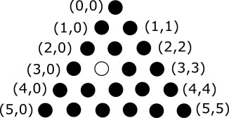
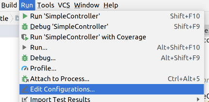
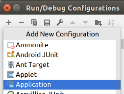
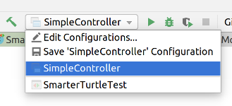

[](https://classroom.github.com/open-in-codespaces?assignment_repo_id=15535802)
# Marble Solitaire Part 3 🃏🎮🕹️🎯🪀

## Variations of Marble Solitaire

## 1 Purpose

The benefits of the model-view-controller architecture shine when we need to add new features, by isolating relevant parts of our design and changing them independently. In this assignment we will see those benefits pay off by supporting other forms of Marble Solitaire. The goal of this assignment is to give you a chance to critically examine your earlier design choices, and either leverage or revise them to enable adding variations of this game with minimal change and duplication of code.

All new classes and interfaces for this homework relevant to the model should be in the `cs3500.marblesolitaire.model.hw04` package. All classes written in previous assignments, even if improved upon, should remain in their respective packages. A starter file has been provided to you whose sole purpose is to ensure your code is in the correct packages with the correct visibility.

2 Marble Solitaire with other shapes

There is nothing intrinsic about the board shape or size we're using, and we can imagine the rules of this game being applied to boards of different sizes and shapes. In this assignment you will consider two more variations:

A European Marble Solitaire board is similar to an English board, except the corners between the arms of the cross are filled in to produce an octagon shape. The initial hole will again be in the center.

Perhaps a more interesting variant is Triangular Marble Solitaire. As its name suggests, the board for Triangular Marble Solitaire has marbles arranged in an equilateral triangle. A family of such games can be created by modifying the dimension of this board, in the form of the number of marbles in its bottom-most row. The following figure shows a 6-row Triangular Marble Solitaire version.



What sets this variant apart from the English and European versions is that the marbles are not arranged in a rectangular grid. We arbitrarily set a coordinate system to align with the board as shown in the figure above. Specifically, the marbles in row i (starting with row 0) can be indexed as (i,0) to (i,i). You may think of this as a pair of axes (like the rectangular grid) whose vertical axis is aligned with the left edge of the triangle (instead of vertical like that in the rectangular grid).

Like previous versions, this game also starts with a single empty slot whose position can be customized. Marbles can move by jumping over one marble into an empty slot, as before. Because the board is not rectilinear, the jump rules change a bit. Each marble can jump to (a) positions in its own row two columns away left or right; or (b) positions that are two rows above and below, along the four diagonal directions. For example in the above figure the marble from (5,3) can move to (5,1), (5,5), (3,1) and (3,3), if those positions were empty and they could jump over a marble. Similarly, the marble from (3,2) can move to (3,0), (5,2) and (5,4) and (1,0). As before, the score is the number of marbles on the board. The game ends when no more marbles can move, and the game must be played to minimize the score.

## 3 The View

The existing view implementation will likely not work for the triangular version of Marble Solitaire. Therefore you must implement another view named `TriangleSolitaireTextView` that implements the same `MarbleSolitaireView` interface.

## 4 Assignment Requirements and Design Constraints

* Design classes implementing the European and Triangular variants of Marble Solitaire, as explained below.
* Design the `TriangleSolitaireTextView` implementation of the view, as explained above.
* Implement a `main` method to allow you to choose different board shapes from the command line, when running your program, as explained below.
* Test everything thoroughly: make sure the new models work properly, and that the controller can control them as well as it could the original model. You do not need to test your main method.

You must complete these requirements while respecting the following constraints:

* You are not allowed to change the interface of the model (`MarbleSolitaireModel`) at all.
* You are not allowed to change the controller interface (`MarbleSolitaireController`) at all.
* You must create separate model implementations. That is, models that represent all variations of the game must co-exist in separate classes.

In this assignment it is important not only to have a correctly working model, but also a design that uses interfaces and classes appropriately. Make sure you minimize replication of code. You may refactor your earlier designs to do this. You *may* also have to change earlier implementations to remove bugs. This is OK, but *must* be properly documented and justified. Again, you are not allowed to change existing interfaces or add new public methods.

## 5 The EuropeanSolitaireModel class

Design a class with the above name that (directly or indirectly) implements the MarbleSolitaireModel interface. Besides implementing all required methods, this class should offer the following constructors:

* A default constructor (no parameters) that creates an octagonal board whose sides have length 3, with the empty slot in the center of the board.
* A constructor with a single parameter (the side length) that creates a game with the specified side length, and the empty slot in the center of the board.
* A constructor with two parameters (row, col), to specify the initial position of the empty slot, in a board of default size 3.
* A constructor with three parameters (side length, row, col), to specify the size of the board and the initial position of the empty slot.

The view should transmit a string for this version as the example shows (for the default board):

```
    O O O
  O O O O O
O O O O O O O
O O O _ O O O
O O O O O O O
  O O O O O
    O O O
```

(As with prior assignments, there are no trailing spaces after the last position on each row, and the game state does *not* end in a newline character.)

**Hint**: this model is very similar to the one you build in the first assignment in this series. Your code should take advantage of that fact. We expect you to minimize code duplication.

## 6 The TriangleSolitaireModel class

Design a class with the above name that (directly or indirectly) implements the `MarbleSolitaireModel` interface from earlier assignments. Besides implementing all required methods, this class should offer the following constructors:

* A default constructor (no parameters) that creates a 5-row game with the empty slot at (0,0).
* A constructor with a single parameter (dimensions) that creates a game with the specified dimension (number of slots in the bottom-most row) and the empty slot at (0,0). This constructor should throw the `IllegalArgumentException` exception if the specified dimension is invalid (non-positive).
* A constructor with two parameters (row,col) that creates a 5-row game with the empty slot at the specified position. This constructor should throw the `IllegalArgumentException` exception if the specified position is invalid.
* A constructor with three parameters (dimensions,row,col) that creates a game with the specified dimension and an empty slot at the specified row and column. This constructor should throw the `IllegalArgumentException` exception if the specified dimension is invalid (non-positive) or the specified position is invalid.

The view should transmit a string for this version as the example shows:

```
      O
     O O
    O O _
   O O O O
  O O O O O
 O O O O O O
O O O O O O O
```

(As with prior assignments, there are no trailing spaces after the last position on each row, and the game state does not end in a newline character.)

**Hint**: this board is somewhat different from the other two, because its coordinate system is not standard Cartesian coordinates. Moreover, the set of legal moves from a given coordinate is different (as described earlier). Still, there is much that is similar between these models.

## 7 The `main()` method

Add the following class to your project:

```java
package cs3500.marblesolitaire;

public final class MarbleSolitaire {
  public static void main(String[] args) {
    // FILL IN HERE
  }
}
```


This `main()` method will be the entry point for your program. Your program needs to take inputs as command-line arguments (available in your program through the argument `args` above). Review the [documentation for command-line arguments](https://docs.oracle.com/javase/tutorial/essential/environment/cmdLineArgs.html) in a Java program .

Specifically:

* You must pass one of english, european, or triangular. This argument will decide which board shape (and hence which model and view) you should use.
* You may optionally pass the two arguments -size N, where N is a number, to specify the size of the board. If unspecified, you should use the default size for the chosen board shape.
* You may optionally pass the three arguments -hole R C, where R and C are numbers, to specify the row and column of the initial hole in the same manner as players of the game enter move positions. If unspecified, you should use the default hole position for the chosen board shape.

The following are some examples of valid command lines, and their meanings:

* english -size 6 produces a plus-shaped board with arm-width of 6, and initial hole in the center
* triangular produces a triangle-shaped board (as in this assignment) with side-length 5, and initial hole at the top
* triangular -size 4 produces a triangle-shaped board (as in this assignment) with side-length 4, and initial hole at the top
* european -hole 1 4 produces an octagon-shaped board (as in this assignment) with side-length 3, and the initial hole in the middle of the top edge.

This is *not* an exhaustive list; other command lines are possible.

These arguments will appear in the `String[] args` parameter to your `main` method; you can use them however you need to, to configure your models. For this assignment, you do not need to explicitly handle invalid command lines (e.g. by producing an informative error message).

### 7.1 Command line arguments in IntelliJ IDEA

* Go to Run > Edit configurations



* Click the + button in the upper left, and select Application from the dropdown that appears.



* Give the new configuration a name that you'll remember (e.g. "English size 3").
* In the Main class textbox, enter cs3500.marblesolitaire.MarbleSolitaire -- the fully-qualified name of the class with your `main` method.
* In the Program arguments textbox, enter the command line arguments you want to use for this configuration, e.g. english -size 3
* Leave everything else at their defaults, and click Ok.

You can repeat this process as many times as you want, to make as many run configurations as you need. Then to choose among them, use the dropdown menu next to the run icon in the toolbar:



and press Run.

## 8 (Optional) Convenient creation of model and view

**This is optional, meant to sho  w you a new design to make your program better. This will not be tested or graded by us, but rather is for your own enrichment.**

You may notice that it is clunky/inconvenient to have to create a view object that corresponds with the correct model object. One may write a factory method that creates the correct model object depending on suitable input, and another factory method for the view. But how does one ensure that a consistent model-view pair is always created? The answer lies in a related design pattern called the abstract factory.

The concept of an abstract factory is not difficult to understand. Imagine a class that provides two methods: `createModel` and `createView` . One can have three versions of this class, one for each type of solitaire. We can think of each of these classes as factories that manufacture specific types of objects. Finally we can write a factory method that returns an object of one of these three classes!

Specifically, follow these instructions:

1. Create an interface called `MarbleSolitaireAbstractFactory`. It contains three methods: `MarbleSolitaireModel createModel()`, `MarbleSolitaireView createView()` and `MarbleSolitaireView createView(Appendable ap)`. **This is a specification for an abstract factory. You may think of it as a set of factory methods.**
2. Create a class called EnglishSolitaireFactory that implements MarbleSolitaireAbstractFactory. Implement its methods so that createModel returns a EnglishSolitaireModel object and the createView methods return the corresponding view object.
3. Add a constructor to this class that takes in parameters used to create the model (e.g. board dimensions, initial empty position), creates the model and stores it in a field. **This is a ''factory" that produces the model and view for the English Solitaire game.**
4. Create a class called `EuropeanSolitaireFactory` that implements `MarbleSolitaireAbstractFactory`. Implement it similar to above, but for the European variant. **This is a ''factory" that produces the model and view for the European Solitaire game.**
5. Create a class called `TriangleSolitaireFactory` that implements `MarbleSolitaireAbstractFactory`. Implement it similar to above, but for the Triangle variant. **This is a ''factory" that produces the model and view for the Triangle Solitaire game.**
6. Add a static method to the `MarbleSolitaireAbstractFactory` interface: `static MarbleSolitaireAbstractFactory getFactory(String name)`. This method should return the appropriate factory depending on the name passed to it with default parameters(e.g. if passed "english" it should return a `EnglishSolitaireFactory` object). Do the necessary input validation. **You do not have to embed this method inside the abstract factory interface: you can also write this as a static method in another class. The overall idea of the abstract factory remains the same. In fact, embedding it inside the abstract factory interface violates a SOLID principle (which one?)**
7. Add similar static methods that take the parameters necessary to customize the model and create appropriate factory objects. This will allow creating a factory object by specifying the board dimensions and position of the empty cell. Is there a better way to do this than have several static methods (can we use another design pattern)?

## 9 Deliverables

Submit all of your code on GitHub including: 

* Your EuropeanSolitaireModel and TriangleSolitaireModel classes, and any support classes needed.
* Your TriangleSolitaireTextView class and any support classes needed.
* Your controller and model classes and related interfaces from previous assignments (with as few changes to the classes as possible, and any changes fully explained in comments)
* Your class with the main() method.
* Tests for all models in one or more JUnit test classes.

**All new classes and interfaces for this homework should be in the `cs3500.marblesolitaire.model.hw04` package. All classes written in previous assignments, even if improved upon, should be in their respective packages.**

## 10 Grading standards

For this assignment, you will be graded on

* Whether you had to modify any previously written interfaces,
* whether your code implements the specifications (functional correctness),
* how well your code is structured to avoid duplication, improve readability, etc.
* the clarity of your code,
* the comprehensiveness of your test coverage, and
* how well you follow the style guide .

- Commit and Push all of your code to this repo. After submission, check your submitted code to ensure that your project name is an app, or the auto-grading will fail.

---
## 11 Screenshots

- Add screenshots of your code running below as well as several showing your tests passing and code coverage.
